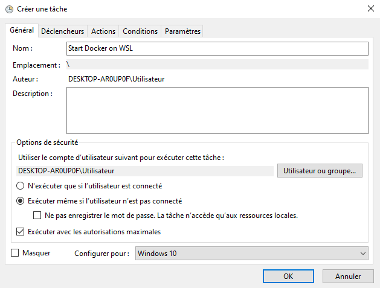
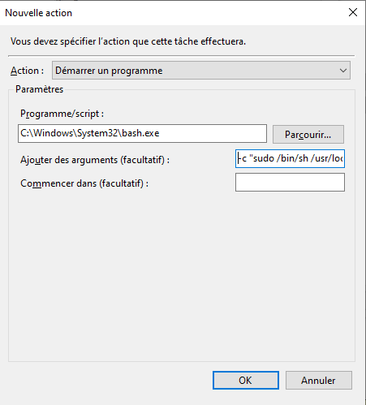

For better User eXperience check Website : [tiamat-azure.github.io][site]

# Linux UBUNTU on Windows 10 (WSL)


This project is intended to log software, libraries and frameworks installation on Linux UBUNTU 18 Windows Subsystem.


# Install Linux UBUNTU in WSL 2

```bash
# check Windows version
ver

Microsoft Windows [version 10.0.18362.476]

# check PowerShell version
$PSVersionTable

Name                           Value
----                           -----
PSVersion                      5.1.18362.145
PSEdition                      Desktop
PSCompatibleVersions           {1.0, 2.0, 3.0, 4.0...}
BuildVersion                   10.0.18362.145
CLRVersion                     4.0.30319.42000
WSManStackVersion              3.0
PSRemotingProtocolVersion      2.3
SerializationVersion           1.1.0.1

```

Source : 
- PowerShell 6 install : 
  - doc : https://docs.microsoft.com/fr-fr/powershell/scripting/install/installing-powershell-core-on-windows?view=powershell-6
  - git url for PowerShell-6.2.3-win-x64.msi : https://github.com/PowerShell/PowerShell/releases/tag/v6.2.3  

    msiexec.exe /package PowerShell-<version>-win-<os-arch>.msi /quiet ADD_EXPLORER_CONTEXT_MENU_OPENPOWERSHELL=1 ENABLE_PSREMOTING=1 REGISTER_MANIFEST=1

Install PowerShell 6 :

```bash
    # One liner install
    iex "& { $(irm https://aka.ms/install-powershell.ps1) } -UseMSI"

    # Check PowerShell version (from PS 6 Application))
    $PSVersionTable

    Name                           Value
    ----                           -----
    PSVersion                      6.2.3
    PSEdition                      Core
    GitCommitId                    6.2.3
    OS                             Microsoft Windows 10.0.19025
    Platform                       Win32NT
    PSCompatibleVersions           {1.0, 2.0, 3.0, 4.0…}
    PSRemotingProtocolVersion      2.3
    SerializationVersion           1.1.0.1
    WSManStackVersion              3.0
```

> Alternative install
>   - doc : https://docs.microsoft.com/fr-fr/powershell/scripting/install/installing-powershell-core-on-windows?view=powershell-6
>  - git url for PowerShell-6.2.3-win-x64.msi : https://github.com/PowerShell/PowerShell/releases/tag/v6.2.3  
>
>```bash
>msiexec.exe /package PowerShell-<version>-win-<os-arch>.msi /quiet ADD_EXPLORER_CONTEXT_MENU_OPENPOWERSHELL=1 ENABLE_PSREMOTING=1 REGISTER_MANIFEST=1
>```


WSL2 install documentation : 
  - https://docs.microsoft.com/en-us/windows/wsl/wsl2-install
  - [install-wsl-2-on-windows-10](https://www.thomasmaurer.ch/2019/06/install-wsl-2-on-windows-10/)

Enable the Windows Subsystem for Linux

    Enable-WindowsOptionalFeature -Online -FeatureName Microsoft-Windows-Subsystem-Linux

Install a Linux distro for the Windows Subsystem for Linux

Enable the Virtual Machine Platform feature

    Enable-WindowsOptionalFeature -Online -FeatureName VirtualMachinePlatform

Set WSL distro to use version 2
```bash
# List Linux distro installed
wsl -l -v

# Set Ubuntu-18.04 Linux distro to use WSL 2
wsl --set-version Ubuntu-18.04 2

# Set WSL 2 as the default version to use for futur Linux distro installation
wsl --set-default-version 2
```
# Update Linux packages

> Doc : [install-updates-on-ubuntu-via-command-line](https://tecadmin.net/install-updates-on-ubuntu-via-command-line/)

```bash
# Fetch the update for all your repositories
sudo apt update

# Upgrade all the packages to latest available versions
sudo apt-get upgrade

# Handle changing dependencies and remove obsolete package
sudo apt-get dist-upgrade

# Apply security updates only
sudo apt-get install unattended-upgrades

# Clean unused packages
sudo apt auto-remove
```

# Configure bash aliases
doc :
>- [bash-aliases-mac-centos-linux-unix.html](https://www.cyberciti.biz/tips/bash-aliases-mac-centos-linux-unix.html)
> - [7-super-useful-aliases-to-make-your-development-life-easier](https://codeburst.io/7-super-useful-aliases-to-make-your-development-life-easier-fef1ee7f9b73)

edit file `~/.bashrc` and add following aliases

```bash
#======================================#
# Aliases
#======================================#

# Reload ~/.bashrc
alias sourceb="source ~/.bashrc"

# Show my ip address
alias myip="curl http://ipecho.net/plain; echo"

## mkdir && cd
alias mkcd='foo(){ mkdir -p "$1"; cd "$1" }; foo '

## git
alias gac="git add . && git commit -a -m "

## npm
alias nis="npm install --save "

## VS Code
alias coder='code -n .'

## get rid of command not found ##
alias cd..='cd ..'
 
## a quick way to get out of current directory ##
alias ..='cd ..'
alias ...='cd ../../../'
alias ....='cd ../../../../'
alias .....='cd ../../../../'
alias .4='cd ../../../../'
alias .5='cd ../../../../..'

# handy short cuts #
alias c='clear'
alias h='history'
alias hs='history | grep'
alias j='jobs -l'


# Stop after sending count ECHO_REQUEST packets #
alias ping='ping -c 5'
# Do not wait interval 1 second, go fast #
alias fastping='ping -c 100 -s.2'

# update packages
alias apt-get="sudo apt-get"
 
# update on one command
alias update='sudo apt-get update && sudo apt-get upgrade && sudo apt-get dist-upgrade && sudo apt auto-remove'
alias updatey='sudo apt-get update --yes && sudo apt-get upgrade --yes && sudo apt-get dist-upgrade --yes && sudo apt auto-remove'
alias updatesys="sudo apt-get install unattended-upgrades"
alias updateall='sudo apt-get update --yes && sudo apt-get upgrade --yes && sudo apt-get dist-upgrade --yes && sudo apt-get install unattended-upgrades && sudo apt auto-remove'

# become root #
alias root='sudo -i'
alias su='sudo -i'

## NGINX
alias nginxreload='sudo /usr/local/nginx/sbin/nginx -s reload'
alias nginxtest='sudo /usr/local/nginx/sbin/nginx -t'

## pass options to free ##
alias meminfo='free -m -l -t'
 
## get top process eating memory
alias psmem='ps auxf | sort -nr -k 4'
alias psmem10='ps auxf | sort -nr -k 4 | head -10'
 
## get top process eating cpu ##
alias pscpu='ps auxf | sort -nr -k 3'
alias pscpu10='ps auxf | sort -nr -k 3 | head -10'
 
## Get server cpu info ##
alias cpuinfo='lscpu'

## set some other defaults ##
alias df='df -hPT | column -t'
alias du='du -ch'

## Date and Time Aliases
alias d='date +"%F"'
alias now='date +"%F %T"'
```

# Install Java

Doc :
> [how-to-install-java-with-apt-on-ubuntu-18-04](https://www.digitalocean.com/community/tutorials/how-to-install-java-with-apt-on-ubuntu-18-04)
> [install-and-manage-multiple-java-versions-on-linux-using-alternatives](https://dev.to/thegroo/install-and-manage-multiple-java-versions-on-linux-using-alternatives-5e93)

```bash
# Check java version
java -version

# Install openjdk 8 and 11
sudo apt install openjdk-8-jre-headless -y
sudo apt install openjdk-8-jdk-headless -y
#sudo apt install openjdk-11-jre-headless -y
#sudo apt install openjdk-11-jdk-headless -y

# Check java version
java -version

openjdk version "1.8.0_222"
OpenJDK Runtime Environment (build 1.8.0_222-8u222-b10-1ubuntu1~18.04.1-b10)
OpenJDK 64-Bit Server VM (build 25.222-b10, mixed mode)

# Check javac version
javac -version

javac 1.8.0_222

# Managing JVM versions installed
sudo update-alternatives --config java
sudo update-alternatives --config javac

# Configure JAVA_HOME environement variable
sudo nano /etc/environment

# Set JAVA_HOME
JAVA_HOME="/usr/lib/jvm/java-11-openjdk-amd64/bin/"

# Apply modifications
source /etc/environment

# Verify
echo $JAVA_HOME

# Verify java alternatives
update-java-alternatives --list

java-1.11.0-openjdk-amd64      1111       /usr/lib/jvm/java-1.11.0-openjdk-amd64
java-1.8.0-openjdk-amd64       1081       /usr/lib/jvm/java-1.8.0-openjdk-amd64

# Switch jvm with update-java-alternatives command
update-java-alternatives -l
sudo update-java-alternatives -s java-1.8.0-openjdk-amd64
```
# Install SDKMAN! 

```bash
# Install
curl -s "https://get.sdkman.io" | bash

# Apply 
source "$HOME/.sdkman/bin/sdkman-init.sh"

# Check version
sdk version
```

# Install Gradle (with sdkman)

```bash
# Install gradle latest version
sdk i gradle

# Check gradle version
gradle -v

------------------------------------------------------------
Gradle 6.0.1
------------------------------------------------------------

Build time:   2019-11-18 20:25:01 UTC
Revision:     fad121066a68c4701acd362daf4287a7c309a0f5

Kotlin:       1.3.50
Groovy:       2.5.8
Ant:          Apache Ant(TM) version 1.10.7 compiled on September 1 2019
JVM:          1.8.0_222 (Private Build 25.222-b10)
OS:           Linux 4.19.79-microsoft-standard amd64

# List gradle available versions
sdk ls gradle

# Install gradle 5
sdk i gradle 5.6.4

# Use gradle specific version
sdk u gradle 6.0.1

# Check GRADLE_HOME environment variable
echo $GRADLE_HOME
```

# Configure Git

```bash
git config --global credential.helper "/mnt/c/Program\ Files/Git/mingw64/libexec/git-core/git-credential-manager.exe" \
&& git config --global user.name "Tiamat" \
&& git config --global user.email "tiamat.azure@gmail.com"
```

# Install nvm

```bash
# Install nvm
curl -o- https://raw.githubusercontent.com/nvm-sh/nvm/v0.35.1/install.sh | bash

# Apply profile
source .bashrc

# Install node versions (latest and LTS)
nvm install v12.13.0
nvm use v12.13.0
nvm install v13.1.0

# Check version
nvm --version && node -v && npm -v

0.35.1
v12.13.0
6.12.0
```


# Install Docker

Doc :
> [docker-running-seamlessly-in-windows-subsystem-linux](https://medium.com/faun/docker-running-seamlessly-in-windows-subsystem-linux-6ef8412377aa)
> 
> [how-to-install-and-use-docker-on-ubuntu-18-04](https://www.digitalocean.com/community/tutorials/how-to-install-and-use-docker-on-ubuntu-18-04)


First thing’s first- lets get rid of any previous installations of Docker

    sudo apt-get remove docker docker-engine docker.io containerd runc


First, update your existing list of packages :

    sudo apt update

Next, install a few prerequisite packages which let apt use packages over HTTPS :

    sudo apt install apt-transport-https ca-certificates curl software-properties-common

Then add the GPG key for the official Docker repository to your system :

    curl -fsSL https://download.docker.com/linux/ubuntu/gpg | sudo apt-key add -

Add the Docker repository to APT sources :

    sudo add-apt-repository "deb [arch=amd64] https://download.docker.com/linux/ubuntu bionic stable"

Next, update the package database with the Docker packages from the newly added repo :

    sudo apt update

Make sure you are about to install from the Docker repo instead of the default Ubuntu repo :

    apt-cache policy docker-ce

Install Docker :

    sudo apt install docker-ce

You can list available versions included the one installed locally :

    apt list -a docker-ce

Finally, we need to add your current user to the ‘docker’ group so that you are allowed to interface with the Docker Engine which will be running on your system as root :

    sudo usermod -aG docker $USER

Now, we need to start Docker’s Service with Windows. We'll create a new script :

    sudo nano /usr/local/sbin/start_docker.sh

With the following content :

```bash
    #!/usr/bin/env bash

    sudo cgroupfs-mount
    sudo service docker start
```

Enable execution + execute it :

```bash
    sudo chmod +x /usr/local/sbin/start_docker.sh

    # Lock down edit privileges
    sudo chmod 755 /usr/local/sbin/start_docker.sh
    /bin/sh /usr/local/sbin/start_docker.sh
```
Next, we need to call our script with as root without user input :

    sudo nano /etc/sudoers

And add the following to the bottom of the file :
```bash
    # Enable docker services to start without sudo
    <your username here> ALL=(ALL:ALL) NOPASSWD: /bin/sh /usr/local/sbin/start_docker.sh
```

Finally, start docker in an elevated prompt when Windows boots :

Windows Task Scheduler > Create Task + select “Run with highest privileges”.


Trigger user logon


New Action `C:\Windows\System32\bash.exe` and command argument `-c "sudo /bin/sh /usr/local/sbin/start_docker.sh"`



Right click the task we created in the Task Scheduler library and click Run! 

Test docker :

    docker run --rm hello-world


[jhi]: https://www.jhipster.tech/
[sb]: https://spring.io/projects/spring-boot
[ng]: https://angular.io/
[site]: https://tiamat-azure.github.io/linux-ubuntu-windows/